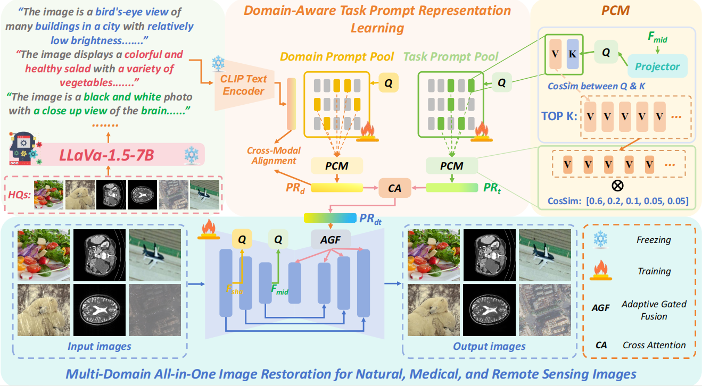
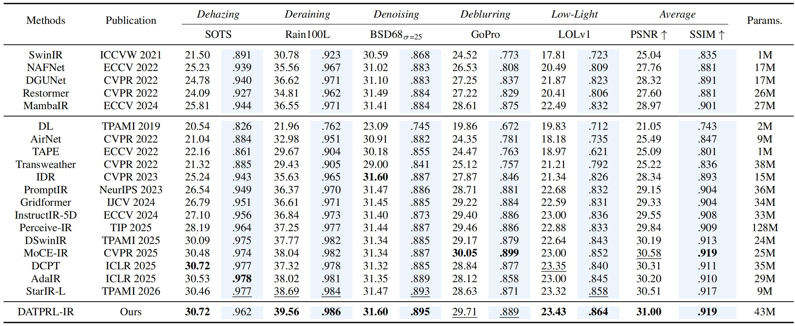
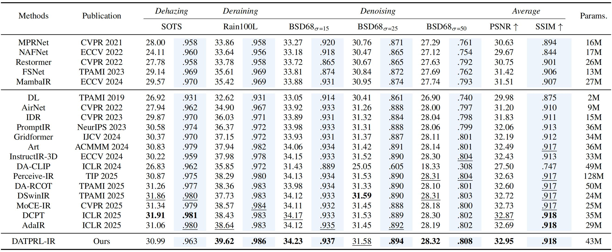
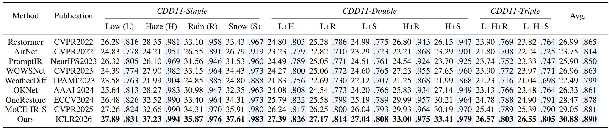

# Learning Domain-Aware Task Prompt Representations for Multi-Domain All-in-One Image Restoration

<p align="center">
  <b>Learning Domain-Aware Task Prompt Representations for Multi-Domain All-in-One Image Restoration</b>
</p>

<p align="center">
  <a href="https://iclr.cc/virtual/2026/poster/10010810"></a>
  <a href="https://arxiv.org/abs/2603.01725"></a>
  <a href="https://github.com/GuangluDong0728/DATPRL-IR"></a>
  
  
</p>

<p align="center">
  <a href="https://iclr.cc/virtual/2026/poster/10010810">ICLR 2026 Poster</a> ·
  <a href="https://arxiv.org/abs/2603.01725">Paper</a> ·
  <a href="#-pre-trained-models">Pre-trained Models</a> ·
  <a href="#-results">Results</a> ·
  <a href="#-citation">Citation</a>
</p>

<p align="center">
  
</p>

> **DATPRL-IR** is the first exploration of **Multi-Domain All-in-One Image Restoration (MD-AiOIR)**. It handles diverse restoration tasks across **natural scene**, **medical imaging**, and **remote sensing** domains with a single unified model by learning **domain-aware task prompt representations**.

---

## 🔥 News

* **2026.05**: We conduct extra experiments on natural-image **5-task**, **3-task**, and **combined-degradation** all-in-one settings. Experimental [results](#-results), [model weights](#-pre-trained-models), and code are released. Our DATPRL-IR achieves **31.00 dB / 0.919** average PSNR/SSIM on the 5-task setting, **32.95 dB / 0.918** on the 3-task setting, and **30.88 dB / 0.890** on the combined-degradation CDD11 setting.
* **2026.05**: We release the [model weights](#-pre-trained-models) and code for the **3-domain 6-task to 9-task** settings reported in the paper.
* **2026.01**: DATPRL-IR is accepted by **ICLR 2026**.

---

## ✨ Highlights

* **First MD-AiOIR framework**: one model for multiple image domains and restoration tasks.
* **Dual prompt pools**: a task prompt pool and a domain prompt pool encode task-level and domain-level knowledge.
* **Prompt Composition Mechanism (PCM)**: adaptively composes selected prompts into instance-level representations.
* **Domain-aware restoration**: domain priors distilled from MLLMs help the model better understand different image domains.
* **Adaptive Gated Fusion (AGF)**: dynamically controls the contribution ratio between prompt representations and backbone features at different network layers.
* **Strong scalability**: DATPRL-IR remains robust when extending from 6 tasks to 9 tasks.
* **Extra natural-image AiOIR benchmarks**: we additionally provide classic natural-image all-in-one settings, including **3-task**, **5-task**, and **combined-degradation** settings, together with open-source weights. DATPRL-IR surpasses existing SOTA methods by **+0.08 dB**, **+0.42 dB**, and **+1.83 dB** average PSNR on the **3-task**, **5-task**, and **combined-degradation CDD11** settings, respectively.

---

## 🧠 Method Overview

<p align="center">
  
</p>

DATPRL-IR adopts a **query–retrieval–composition** paradigm:

1. **Task Prompt Pool** learns task-related knowledge shared by and specific to different restoration tasks.
2. **Domain Prompt Pool** learns domain-aware priors for natural, medical, and remote sensing images.
3. **PCM** composes the most relevant prompts into instance-level task/domain representations.
4. **Adaptive Gated Fusion (AGF)** injects the final domain-aware task prompt representation into the restoration backbone.

---

## 📌 Supported Tasks

### Multi-domain all-in-one restoration

| Domain               | Task                 | Dataset / Benchmark |
| :------------------- | :------------------- | :------------------ |
| Natural Image        | 4× Super-Resolution  | DF2K / DIV2K-Val    |
| Natural Image        | Deraining            | Rain100L            |
| Natural Image        | Motion Deblurring    | GoPro               |
| Medical Image        | MRI Super-Resolution | IXI MRI             |
| Medical Image        | CT Denoising         | AAPM-Mayo           |
| Medical Image        | PET Synthesis        | PolarStar m660      |
| Remote Sensing Image | 4× Super-Resolution  | UCMerced            |
| Remote Sensing Image | Cloud Removal        | CUHK-CR1            |
| Remote Sensing Image | Dehazing             | RICE1               |

### Extra natural-image all-in-one settings

| Setting                | Tasks                                              | Dataset / Benchmark                     |
| :--------------------- | :------------------------------------------------- | :------------------------------------------ |
| Natural-AiOIR-3T       | Dehazing + Deraining + Denoising                         | SOTS + Rain100L + WED & BSD400    |
| Natural-AiOIR-5T       | Dehazing + Deraining + Deblurring + Denoising + Lowlight | SOTS + Rain100L + GoPro + WED & BSD400 + LOL   |
| Natural-AiOIR-Combined | Combined / mixed degradations                      | [CDD11](https://github.com/gy65896/onerestore) |

---

## 📊 Results

### Main MD-AiOIR results

#### Qualitative results

Visual inference results for the 3-domain 6-task MD-AiOIR setting are released at [3-domain-6-task-results](https://drive.google.com/file/d/1l1GTKBmYk4Ekz-C5Y9rgV_oS6lxAxa1-/view?usp=drive_link)

Visual inference results for the 3-domain 9-task MD-AiOIR setting are released at [3-domain-9-task-results](https://drive.google.com/file/d/1dPwTUnBozb5qB874vjvULNBJPJZkSeZB/view?usp=drive_link)

#### Quantitative results

| Setting      | Domains | Tasks | Avg. PSNR ↑ | Avg. SSIM ↑ |
| :----------- | :-----: | :---: | :---------: | :---------: |
| DATPRL-IR-6T |    3    |   6   |    30.77    |    0.8653   |
| DATPRL-IR-7T |    3    |   7   |    30.74    |    0.8643   |
| DATPRL-IR-8T |    3    |   8   |    30.74    |    0.8647   |
| DATPRL-IR-9T |    3    |   9   |    30.78    |    0.8645   |

### Natural-image all-in-one results

#### Qualitative results

Visual inference results for the natural-image 5-task setting are released at [5-task-results](https://drive.google.com/file/d/1MAd33dQhRRLIWp_yhoSZ40yRCce0EvmT/view?usp=drive_link)

Visual inference results for the natural-image 3-task setting are released at [3-task-results](https://drive.google.com/file/d/103kLC4-30XAqRevx7zA5gz7tdwdGPJ7m/view?usp=drive_link)

Visual inference results for the natural-image mixed-degradation CDD11 setting are released at [CDD11-results](https://drive.google.com/file/d/1DBa7Shtkf6jreKQQV1qR678Lzhcvr6Es/view?usp=drive_link)

#### Quantitative results

<p align="left">
  <em>Quantitative results on 5-Task natural image AiOIR.</em>
</p>
<p align="left">
  
</p>

<p align="left">
  <em>Quantitative results on 3-Task natural image AiOIR.</em>
</p>
<p align="left">
  
</p>

<p align="left">
  <em>Quantitative results on mixed-degradation natural image AiOIR with CDD11 dataset.</em>
</p>
<p align="left">
  
</p>

## 🧩 Repository Structure

```text
ICLR/
├── All_in_One/                     # Extra natural-image all-in-one experiments
│   ├── 5task_test/                 # Test logs for the natural-image 5-task setting
│   ├── net/                        # Network architecture
│   │   ├── promptpoolnafnetv3_arch.py
│   │   ├── promptrestormerv3_arch.py
│   │   └── restormer_arch.py
│   ├── utils/                      
│   ├── options.py                  
│   ├── test_v2.py                  # Testing 
│   ├── train_3task.py              # Training for the 3-task setting
│   └── train_5task.py              # Training for the 5-task setting
├── MD_All_in_One/                  # Main multi-domain all-in-one restoration code
│   ├── experiments/                # Experiment records / checkpoints
│   ├── options/                    # YAML configuration files
│   │   ├── train/
│   │   └── test/
│   ├── scripts/                    # Helper scripts
│   ├── requirements.txt            # Python dependencies
│   ├── setup.cfg
│   └── setup.py
├── figure/                         # Figures used in README
└── README.md
```

---

## 🛠️ Installation

```bash
cd MD_All_in_One

pip install -r requirements.txt
python setup.py develop
```

> The codebase follows the BasicSR-style training / testing pipeline. Please adjust the PyTorch and CUDA versions according to your own environment.

---

## 🚀 Inference

### Test MD-AiOIR models

```bash
cd MD_All_in_One
python basicsr/test.py -opt options/test/test_allinone_6task_ours.yml
```

### Test natural-image all-in-one models

```bash
# 5-task natural-image all-in-one model
cd All_in_One
python test_v2.py

# Combined-degradation natural-image all-in-one model
cd MD_All_in_One
python basicsr/test.py -opt options/test/test_cdd11.yml
```

---

## 📦 Pre-trained Models

| Model                  |               Domains              |         Tasks        | Checkpoint  |
| :--------------------- | :--------------------------------: | :------------------: | :---------- |
| DATPRL-IR-6T           | Natural + Medical + Remote Sensing |           6          |  [3Domain-6Task](https://drive.google.com/file/d/1in_G7hdsAju3sfkyYKgWA0YQlYwgSXTX/view?usp=drive_link)  |
| DATPRL-IR-7T           | Natural + Medical + Remote Sensing |           7          |  [3Domain-7Task](https://drive.google.com/file/d/1QhOGifvOzd49cb1r6ufsMGT5ZpZPG8iE/view?usp=drive_link)  |
| DATPRL-IR-8T           | Natural + Medical + Remote Sensing |           8          |  [3Domain-8Task](https://drive.google.com/file/d/1nZopEdYD2rtsL_k8SQ2vCilWozpsHgXq/view?usp=drive_link)  |
| DATPRL-IR-9T           | Natural + Medical + Remote Sensing |           9          |  [3Domain-9Task](https://drive.google.com/file/d/1cWzLya6c0npyQTb7J6zup7umWNu_izN8/view?usp=drive_link)  |
| Natural-AiOIR-3T       |               Natural              |           3          |  [Natural-3Task](https://drive.google.com/file/d/1xxt5eVQffu7gZ3fxW08jkGdV9cbohRjk/view?usp=drive_link)  |
| Natural-AiOIR-5T       |               Natural              |           5          |  [Natural-5Task](https://drive.google.com/file/d/1ZUjahXyRJAsYdO5DruWx97FuVJjXzrkD/view?usp=drive_link)  |
| Natural-AiOIR-Combined |               Natural              | Combined degradation |  [Natural-CDD11](https://drive.google.com/file/d/1JxSthoQ-96VcUOTkXu9F9XEQus0v7xol/view?usp=drive_link)  |


---

## 🙏 Acknowledgements

This project is built upon and inspired by several excellent open-source projects and papers:

* [BasicSR](https://github.com/XPixelGroup/BasicSR)
* [Restormer](https://github.com/swz30/Restormer)
* [StarIR](https://github.com/c-yn/StarIR)
* [L2P: Learning to Prompt for Continual Learning](https://github.com/google-research/l2p)
* [PyIQA](https://github.com/chaofengc/iqa-pytorch)

We sincerely thank the authors for their contributions to the community.

---

## 📄 Citation

If this work is useful for your research, please consider citing:

```bibtex
@inproceedings{dong2026datprlir,
  title     = {Learning Domain-Aware Task Prompt Representations for Multi-Domain All-in-One Image Restoration},
  author    = {Dong, Guanglu and Li, Chunlei and Ren, Chao and Hu, Jingliang and Shi, Yilei and Zhu, Xiao Xiang and Mou, Lichao},
  booktitle = {International Conference on Learning Representations},
  year      = {2026}
}
```

```bibtex
@article{dong2026learning,
  title   = {Learning Domain-Aware Task Prompt Representations for Multi-Domain All-in-One Image Restoration},
  author  = {Dong, Guanglu and Li, Chunlei and Ren, Chao and Hu, Jingliang and Shi, Yilei and Zhu, Xiao Xiang and Mou, Lichao},
  journal = {arXiv preprint arXiv:2603.01725},
  year    = {2026}
}
```

---

## 📬 Contact

For questions, please open an issue in this repository or contact the authors listed in the paper.
